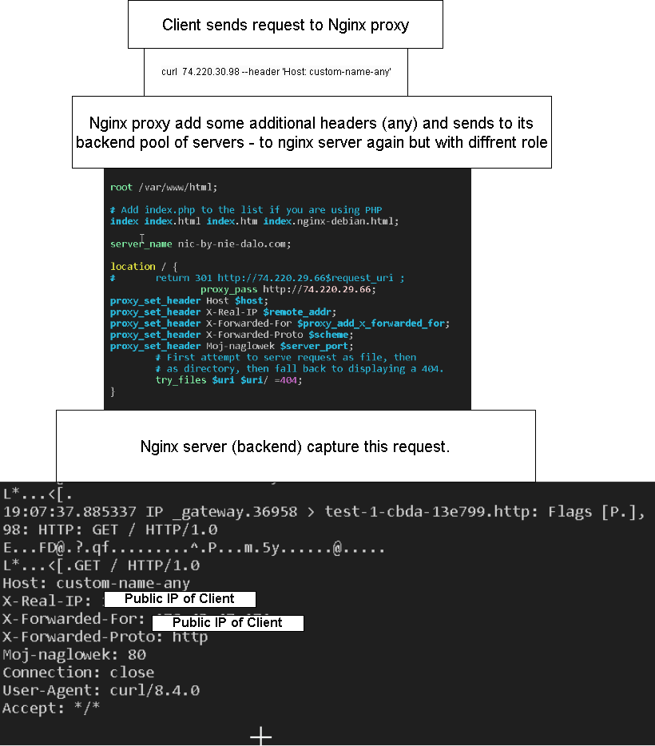

#### SSL Termination
In Nginx works by adding `ssl_certificate` field and nginx automatically decrypt traffic. Then decrypted traffic we can pass to others application or nginx proxy server using `proxy_pass`
e.g.
```
server {
    listen              443 ssl;
    server_name         www.example.com;
    ssl_certificate     www.example.com.chained.crt;
    ssl_certificate_key www.example.com.key;
    #...
}
```

#### Headers 




#### Generate self signed certificate to investigate https
```
sudo openssl req -x509 -nodes -days 365 -newkey rsa:2048 -keyout /etc/ssl/private/nginx-selfsigned.key -out /etc/ssl/certs/nginx-selfsigned.crt
```

#### Install Nginx 
```
civo instance create test-2 -u ubuntu --sshkey from-id-rsa --publicip create --size g4s.xsmall --diskimage=ubuntu-jammy
apt update -y && apt install nginx -y
```


tcpdump -i enp1s0 tcp port http